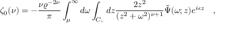

# 🚀 Exporting PP-FormulaNet_plus-M Model to ONNX

> Step-by-step guide to converting **PP-FormulaNet_plus-M** from PaddlePaddle to **ONNX**, fixing the model, and running predictions.

---

## 📦 Installation

1. **Clone the repository**
   ```bash
   git clone https://github.com/FahNos/pp_formula_to_onnx.git
   cd pp_formula_to_onnx
   ```

2. **Install dependencies**
   ```bash
   pip install -r requirements_onnx.txt
   ```

3. **Download pre-trained model**
   ```bash
   wget -P ./pretrained_model    https://paddle-model-ecology.bj.bcebos.com/paddlex/official_pretrained_model/PP-FormulaNet_plus-M_pretrained.pdparams
   ```

---

## ⚙️ Export the ONNX model
```bash
python ./tools/export_onnx.py --config ./configs/rec/PP-FormuaNet/PP-FormulaNet_plus-M_ONNX.yaml
```

---

## 🛠 Fix the ONNX model
```bash
python ./tools/fix_head_onnx.py
```

---

## 🔍 Run prediction
```bash
python ./tools/onnx_predict_pp_formualnet_plus_M.py --config ./configs/rec/PP-FormuaNet/PP-FormulaNet_plus-M_ONNX.yaml
```

---

## 📷 Input Image


---

## 📊 Prediction Result
```text
\zeta_{0}(\nu)=-\frac{\nu\varrho^{-2\nu}}{\pi}\int_{\mu}^{\infty}d\omega\int_{C_{+}}d z\frac{2z^{2}}{(z^{2}+\omega^{2})^{\nu+1}}\breve{\Psi}(\omega;z)e^{i\epsilon z}\quad,
```

---

## ⭐ Support
If this project helps you, please give it a **⭐ Star** on GitHub!
